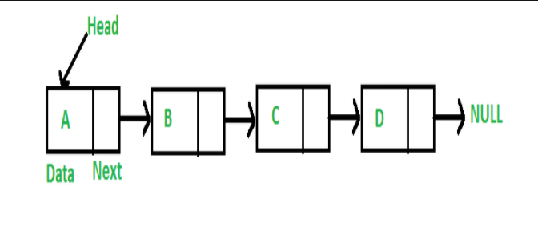
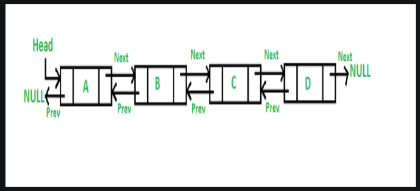
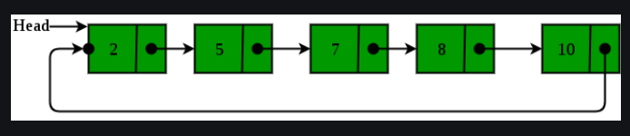

# Topic :- Linked  List 
# Date :- 20th September 2021


In the domain of Data Structures and Algorithm there are two types 
1) Linear Data Structures -> Linked List, Array, Stack, Queue, etc. 
2) Non Linear Data Structures -> Trees, Graphs, Dictionries, etc. 

In this folder I have added all the concepts of Linked List 

Linked List is nothing but a sequence of data structure, which are connected together via links. Linked List is a sequence of links which contains items. Each link contains a connection to another link. Linked list is the second most-used data structure after array.  Following are the important terms to understand the concept of Linked List.

1) Link − Each link of a linked list can store a data called an element.
2) Next − Each link of a linked list contains a link to the next link called Next.
3) LinkedList − A Linked List contains the connection link to the first link called First


# Types of Linked List 
1) Simple Linked List   -> Navigation is possible in One Direction Only 
2) Doubly Linked List   -> Navigation is Possible in Both Direction 
3) Circular Linked List -> Last item contains link of the first element as next and the first element has a link to the last element as previous

# Visualization of all types of Linked List
1) Simple Linked List



2) Doubly Linked List



3) Circular Linked List 




# Basic Operations We can perform on Linked List are as follow 
1) Insertion -> Adds an element at the beginning of the list.
2) Deletion  -> Deletes an element at the beginning of the list.
3) Display   -> Displays the complete list.
4) Search    -> Searches an element using the given key.

Now let's discuss about each operation one by one 

# Data Insertion Code

   ```sh
struct Node *newnode = (struct Node*)malloc(sizeof(struct Node));
newnode->data = value;
newnode->next = *head;

  ```

# Explanation 
1) Consider we have created 3 nodes 
2) Values is variable in which data will be taken from user to insert in Linked List 
3) Head is pointing to node 1
4) Node is divided in two parts 1) data part 2) next part 
5) Integer from value variable is stored in data part of node 1 
6) next is the pointer which is pointing to data part of node 2 
7) now from the third line of code we can see that the head pointer ispointing to next node which is node 2 
8) Till now the 1st data is taken from user and inserted in node 1 
9) Now Data insertion loop will execute again 
10) Data will be taken from user and previously we have seen head is pointing to node 2. 
11) So data which is taken from user it will get stored in data part of node 2 
12) and further process will go on continuously. 


# Data Deletion Code

   ```sh
    Node* temp = *head_ref;                   		            // Store head node
    Node* prev = NULL;
     
    if (temp != NULL && temp->data == key)			    // If head node itself holds
								    // the key to be deleted
    {
        *head_ref = temp->next; 			   	    // Changed head
        delete temp;            				    // free old head
        return;
    }
 
    								   // Else Search for the key to be deleted,
							    	   // keep track of the previous node as we
							           // need to change 'prev->next' */
      else
    {
    while (temp != NULL && temp->data != key)
    {
        prev = temp;
        temp = temp->next;
    }
 
    								   // If key was not present in linked list
    if (temp == NULL)
        return;
 
    								  // Unlink the node from linked list
    prev->next = temp->next;
 
    								 // Free memory
    delete temp;
    }
  ```
  
  Read comments to uderstand the code od deletion 
  
# Data Display Code   

   ```sh
    while (node != NULL)
    {
        cout << node->data << " ";
        node = node->next;
    }
  ```
  
# Explanation 
1) First compiler will check the condition written inside while loop. It will confirm that the Linked List is not empty. 
2) Now compilet will come inside while loop. Data stored at Node will get Printed. 
3) After Printing Data. Next pointer will point to next node data part. 
4) Next node will get checked wether it is empty or not. 
5) If not empty data will get printed. If it is empty compiler will terminate the execution of while loop. 

# Data Search Code

   ```sh
    Node* current = head; 			// Initialize current 
    while (current != NULL) 
    { 
        if (current->key == x) 
            return true; 
        current = current->next; 
    } 
    return false; 
  ```
  
# Explanation 
1) Head node value will get stored in current node 
2) If current node is not null them while loop will get executed. 
3) Inside loop key value and value from x variable will get compared if match fount true value will return. 
4) Match not fount false will get return. 


In the Linked List folder all the complete codes for Linked List are Uploaded.
